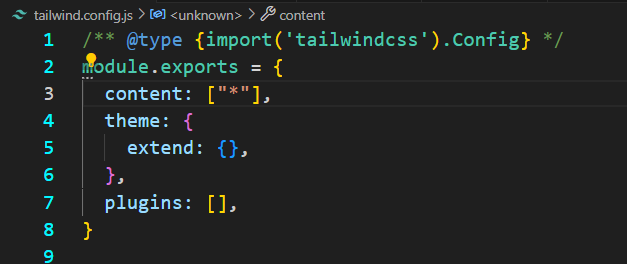
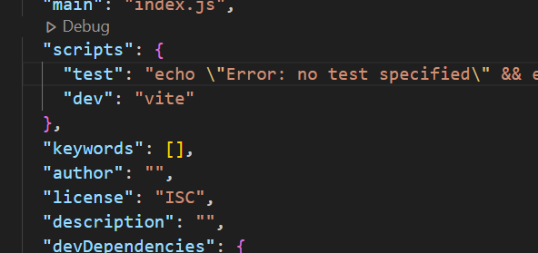
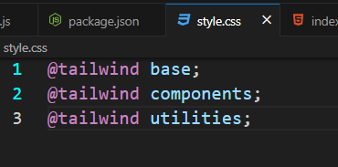

- ## First Create the html file and style.css
```js
1. npm install -D tailwindcss postcss autoprefixer vite
2. npx tailwindcss init -p
``` 

then 
>- tailwind.config.js
>- postcss.config.js

create hoga
- postcss.config.js ko waise ka waise hi rak kuch nahi karna hai.
---



 

---


